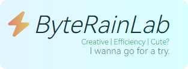

# Axono



Axono 是一个轻量级的人工智能算法库，旨在为教学、研究与原型开发提供简洁可扩展的张量与算子接口。

## 主要特性
- 支持的数据精度：
  - int8、int16、int32、int64、float32、float64  
  （精度接口见 axono.core -> DataType）
- 张量抽象：axono.core -> Tensor
- 常用运算与算子（见 axono.core.operators / axono.core.ops）：
  - 矩阵乘法（matmul），支持 `@` 运算符
  - 加法（add），支持 `+` 运算符
  - 激活函数：`relu(x, inplace: bool=False)`
- NumPy 互操作：
  - Tensor.to_numpy()
  - axono.core.from_numpy(...)
- 设备支持：
  - CPU: `cpu`
  - NVIDIA GPU: `cuda:<id>`

> 请注意：当前为早期开发版（0.1.0），请在正式 release 后再用于生产环境。

## 安装（Linux）
```bash
sh build_env.sh
sh build.sh
python setup.py install
```

## 快速示例
```python
from axono.core import Tensor
import axono.core.ops as ops

a = Tensor.from_numpy(...)
b = Tensor.from_numpy(...)

c = a @ b            # 矩阵乘法
d = a + b            # 加法
e = ops.relu(d)      # ReLU
np_arr = e.to_numpy()
```

## 单元测试
```bash
cd python/tests
python run.py
```